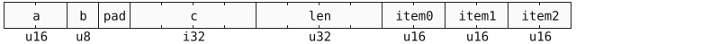

# Structom

structom, structured atoms, is a general purpose data exchange format designed for universal applications.

structom achieve its universality by providing rich and expressive data representation constructs that are highly efficient, lightweight, and bidirectionly compatible.

this document serves as a language specification for structom, documenting all its featureset from data layout till rich types.

### feature set

- expressive object notation designed to ergonomic human readable data files.
- efficient binary encoding desgined for bare metal performance data serialization.
- rich schema ability with module system and forward and backward compatibility.
- schemaless version with full featureset support in object notation and binary encoding.
- rich modeling contructs: tagged unions, tagged types, tree structs, generics, bitfields...
- zero copy binary decoding with streaming and out of order decoding support.
- wide set of rich data types: datetime, duration, uuid, url...
- erasable metadata support for better tooling with common builtin ones.
- simple core with easily ignoreable implementation selected optional extentions.

# object notation foundation

the object notation is json like human readable format of structom, it is designed for expressive data files edited by humans.

```structom
import "./schema.stomd"
Root {
	// comment
	a: "hello world",
	#metadata
	b: 123.456_789,
	c: [true, Color.HSL(1, 2, 3), 0x"ab cd ff"]
}
```

the [gramex](https://docs.rs/gramex/latest/gramex/gram_ref/) metasyntax is used here in syntax definition.

the object notation uses the utf-8 encoding, and the first [`BYTE ORDER MARK (U+FEFF)`](https://en.wikipedia.org/wiki/Byte_order_mark#UTF-8) is removed.

whitespace is insignificant and ignored, used only in token separation.

```gramex
let ws = ' ' | '\t' | '\n' | '\r';
```

identifiers are case sensitive names of things: types, fields, namespaces, variants, and metadata.

```gramex
let ident_start = 'a'..'z' | 'A'..'Z' | '_';
let ident = ident_start (ident_start | '0'..'9')*;
```

### comments

comments follow the general c style of line (`//`) and block (`/* ... */`) comments. block comments can nest.

in addition, unit comments (`/-`) comment out an the entire items they prefix, they are declerations (struct, enums, bitfields), imports, metadata, types and values.

in addition, they comments out array items, map items, fields, tuple fields and generic params, alongside the `,` after them if found.

```gramex
let line_comment = "//" !'\n'* '\n'?;
let block_comment = "/*" (block_comment | !"*/")* "*/";
let unit_comments = "/-" /* context defined unit */;
```

```structom
/* block comment
	/* nested comment */
*/
struct Struct {
	// line comment
	/- field1: nb,
	field1: str,
}
```

### root structure

an object file starts with zero or more imports, then optionally local item declerations, and lastly a root value.

```gramex
let file = import* item* root_value:value;
```

```structom
import "./schema.stomd"
import "../extensions.stomd" as ext

struct Tagged (u32)

Root {
	a: 123,
	b: "hallo",
	c: Tagged 3
}
```

# binary encoding foundation

the binary encoding is machine friendly format of structom designed for high performance serialization

a binary file is interpreted as a sequence of bytes, where data is layed in nested sections.

data is encoded in little endian format aligned to their natural alignment, with some additional padding between sections.

data is encoded as signed / unsigned integers of `n` bits, specified through `u/sn` section type.

array like data is encoded as a section encoding the length, followed by the items sections, they are always `0`-indexed.



## root structure

### header


a binary file starts a header begining with the magic number `53 54 4F 4D (STOM)`.

then it followed by a list of imports encoded as `arr<str>`, it starts with a `u32` length field followed by `str`s encoding the imports paths.

then a list of sections encoded as `arr<u64>`, it starts with a non zero `u32` length field followed by `u64` section offsets.

if there is one section, no offsets need to be specified.

then a `typeid` of the root value is followed

### sections


sections are non uniformly sized part of a binary file.

they created a 2 level address space for the file, decreasing the pointer length (`u32`) while supporting `u64` file sizes.

sections are composed of multiple objects, each object encoded a specific data structure defined by the schema.

objects are aligned to `u64` boundries, they starts with a `u32` section encoding the full size of the object.

the root value is the first object in the first section, all other objects decend from it.

# core types

# declerations

# base types

# structs

# union

# collections

# rich types

# apendix
