# Structom

structom, structured atoms, is a general purpose data exchange format designed for universal applications.

structom achieve its universality by providing rich and expressive data representation constructs that are highly efficient, lightweight, and bidirectionly compatible.

this document serves as a language specification for structom, documenting all its featureset from data layout till rich types.

### feature set

- expressive object notation designed to ergonomic human readable data files.
- efficient binary encoding desgined for bare metal performance data serialization.
- rich schema ability with module system and forward and backward compatibility.
- schemaless version with full featureset support in object notation and binary encoding.
- rich modeling contructs: tagged unions, tagged types, tree structs, generics, ananymous items...
- zero copy binary decoding with streaming and out of order decoding support.
- wide set of rich data types: datetime, duration, uuid, url, semver...
- erasable metadata support for better tooling with common builtin ones.
- simple core with easily ignoreable implementation selected optional extentions.

# foundations

## object notation

the object notation is json like human readable format of structom, it is designed for expressive data files edited by humans.

```structom
import "./schema.stomd"
Root {
	// comment
	a: "hello world",
	#metadata
	b: 123.456_789,
	c: [true, semver "1.2.3", 0x"ab cd ff"]
}
```

the [gramex](https://docs.rs/gramex/latest/gramex/gram_ref/) metasyntax is used here in syntax definition.

the object notation uses the utf-8 encoding, and the first [`BYTE ORDER MARK (U+FEFF)`](https://en.wikipedia.org/wiki/Byte_order_mark#UTF-8) is removed.

whitespace is insignificant and ignored, used only in token separation.

```gramex
let ws = ' ' | '\t' | '\n' | '\r';
```

identifiers are case sensitive names of things: types, fields, namespaces, variants, and metadata.

`keywords` are reserved for the language and forbidden for user defined identifiers. `weak_keywords` are reserved only in specific contexts defined by the grammar.

```gramex
let ident_start = 'a'..'z' | 'A'..'Z' | '_';
let ident = ident_start (ident_start | '0'..'9')* & !keywords;
let keywords = "struct" | "union" | "true" | "false" | "none" | "inf" | "nan";
let weak_keywords = "import" | "as" | "fixed";
```

`list` is a grammar construct that specifies a `,` separated list of items, with optional trailing `,`.

```gramex
let list<item> = item (',' item)* ','?;
```

### comments

comments follow the general c style of line (`//`) and block (`/* ... */`) comments. block comments can nest.

in addition, unit comments (`/-`) comment out an the entire items they prefix, they are items (struct, unions), imports, metadata, types and values.

in addition, they comments out array items, map items, fields and generic params, alongside the `,` after them if found.

#### example

```gramex
let line_comment = "//" !'\n'* '\n'?;
let block_comment = "/*" (block_comment | !"*/")* "*/";
let unit_comments = "/-" /* context defined unit */;
```

```structom
/* block comment
	/* nested comment */
*/
struct Struct {
	// line comment
	/- field1: nb,
	field1: str,
}
```

### root structure

an object file starts with zero or more imports, then optionally local item declerations, and lastly a root value.

values are constructs representing data, they has multiple syntaxes based on their types.

values type is infered by default, but they can specify their type when needed.

```gramex
let file = import* item* root_value:value;
let value = type?:type_spec /* see the value type for the syntax */;
```

#### example

```structom
#!version("0.1.2")
#!import_rich([path])

import "./schema.stomd"
import "../extensions.stomd" as ext

struct Tagged (u32)

Root {
	a: 123,
	b: path "./build/",
	c: Tagged 3
}
```

## binary encoding

the binary encoding is machine friendly format of structom designed for high performance serialization

a binary file is interpreted as a sequence of bytes, where data is layed in nested fields.

data is encoded in little endian format aligned to their natural alignment, with some additional padding between fields.

### core field types

data is encoded as signed / unsigned integers of `n` bits, specified through `u/in` field type.

array like data is encoded as a field encoding the length, followed by the items fields, they are always `0`-indexed.

pointers are `u32` fields encoding forward byte offsets relative to the pointer position, pointing to objects in the curent segment.

null pointers are encoded as `0` `u32`.

#### example

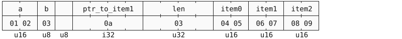

### header

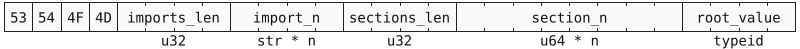

a binary file starts a header specifing core attributes, it is required to standalone files but optional for inlined blobs.

the header begins with the magic number `53 54 4F 4D (STOM)`.

then it followed by a list of imports encoded as `arr<str>`, it starts with a `u32` length field followed by `str`s encoding the imports paths.

then a list of segments encoded as `arr<u64>`, it starts with a non zero `u32` length field followed by `u64` segment offsets.

if there is one segment, no offsets need to be specified.

then a `typeid` of the root value is followed.

#### example

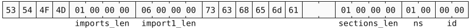

header of 1 import (`"schema"`), 1 segment and root value `import("schema").first_type`;

### segments

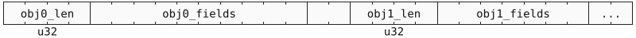

segments are non uniformly sized part of a binary file.

they created a 2 level address space for the file, decreasing the pointer length (`u32`) while supporting `u64` file sizes.

segments are composed of multiple objects, each object encoded a specific data structure defined by the schema.

objects are aligned to `u64` boundries, they usually starts with a `u32` field encoding the full size of the object.

an object whose size is fixed in time (`box<fixed_struct>`) doesnt need the size field.

the root value is the first object in the first segment, parent objects always come before children.

# declerations

declerations are object notation constructs that acts as schemas and define the shape and of data structures.

they are declared above the root value in object files, or in their own specific file called decleration files.

local declerations can refer to each other in any order, not necessary items only above them.

#### example

```structom
import "./module1.stomd"

struct Root {
	a: u8,
	b: Union
	c: struct {
		e: i32,
		f: str
	},
}

union Union {
	A, B, C,
	D(u64),
	E { v?: list<uuid> },
}
```

## imports

```gramex
let import = "import" path:str ("as" ns:ident)?;
```

imports bring the declerations of another decleration file into the scope.

they are declared by the `import` keyword followed by a `str` representing the url / fs path to the decleration file.

if a `ns` identifier is specified, the imported declerations are bringed in their own namespace.

imports can not be circular.

#### example

```structom
// module1.stomd
struct Struct { }

// module2.stomd
import "./module1.stomd"
union Union { }

// module3.stomd
import "./module1.stomd"
import "./module2.stomd" as mod2

sturct Root {
	a: Struct,
	b: mod2.Union
}
```

---

in binary encoding, imports are encoded as `arr<str>` inside the header, where the namespace id is the import index in the array + 1.

## type

### type specifier

```gramex
let type_spec = (ns:ident '.')? item:ident ('<' params:list<type_spec> '>')?
	| inner_def // only in declerations
;
```

type specifiers are object notation contructs that resolves to types, used where a type is expected.

in its basic form, it is the identifier to the type, resolved in the current scope.

a namespace identifier can be specified at the begining, the type is then resolve from that namespace.

if the type is generic, its parameters are specified as type specifiers inside a `,` sperated list enclosed in angle brakets.

in declerations, type specifier can also be inner definitions.

#### example

```structom
import "./module1.stomd" as mod1
struct Local { }
union Generic<A, B, C> { }

struct Root {
	a: Local,
	b: mod1.External,
	b: Generic<u8, str, list<f64>>
}
```

### type identifiers

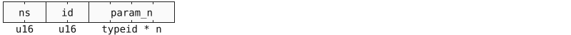

type identifiers are fields in binary encoding that specify the type of a value.

they are composed of 2 `u16` fields, a `ns` namespace identifer, and the type `id` in the namespace.

`ns` `0` is the builtin types namespace, while the rest are assigned to the imported files as their index in `import` array in the header + 1.

if the resolved item is generic, its parameters are specifed as `typeid`s after the base `typeid`.

#### example

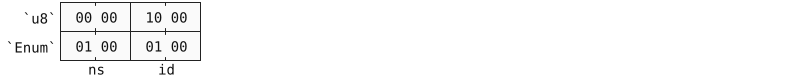

```sturctom
/// module1.stomd
struct Struct { }
union Union<T> { A(T) }

/// value.stomo
import "./module1.stomd"
[u8 10, Union.A<u8> 1]
```

## generics

generics generilaize an item by parameterizing the types of some of its fields.

### object notation

```gramex
let generic_params = '<' list<ident> '>';
```

an item become generic by specifing a set of generic parameters after the its name in the definition.

these paramaters are used as regular types through type specifier by their name.

type specifiers can specify the parameters of a generic item with an angle braket list after the item path.

#### example

```structom
struct Generic<A, C> {
	a: A,
	b: u16,
	c: arr<C, 2>,
}

Generic<str, u8> {
	a: "abc",
	b: 123,
	c: 0x"00 ff"
}
```

### binary

in binary encoding, encoding of fields whose types are generic parameters defers with each concrete instance.

it is always a `u32` field that is interpret as:

- pointer to an object if the instance is an object type.
- inlined instance encoding if its fized and of size 4 bytes or less.
- pointer to an object encoding the instance value directly without length, if the instance is fixed of size greater than 4 bytes.

#### example

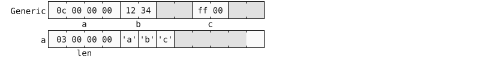

## metadata

```gramex
let metadata = '#' '!'? name:ident ('(' params:list<value> ')')?;
let metavalue = typeid | value |
	'[' list<metavalue>? ']' |
	'{' list<metavalue ':' metavalue>? '}'
;
```

metadata is object notation specific contruct for user defined extra data.

they are usefull for outside tooling and ignored by the parser.

metadata is declared before items, values, types, fields, variants and generic params, using a `#` followed by the metadata name.

metadata can optionally have a metavalue parameters enclosed in paranthesis.

metavalues are values algonside type specifiers and lists and maps of them.

metadata for the whole file are declared before any items and using `#!name`.

#### example

```structom
#!version("0.1.2")
#!import_rich([uuid])

#doc("user info")
struct User {
	#pattern("[a-zA-Z0-9]+")
	name: str,
	id: #private_constructor
		sturct UserId(uuid),
}
```

# core types

## `none`

the `none` type is a special type that has no value.

it decays to default values in optional fields.

### object notation

```gramex
let none_type = "none";
let none_value = "none";
```

### binary encoding

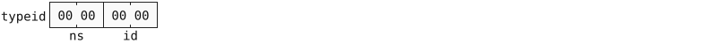

`none` has no value and is 0 aligned

#### example

```structom
struct Root {
	field?: u8 = 1
}
Root { field: none } // identical to Root {} and Root { field: 1 }
```

## `bool`

the `bool` type represent a boolean value: `true` or `false`.

its default value is `false`.

### object notation

```gramex
let bool_type = "bool";
let bool_value = "true" | "false";
```

### binary encoding


**align and size**: 1 bit.

**value**: `1` for `true`, and `0` for `false`.

#### example

```structom
do_thing: false,
is_thing: true,
```

## integers

the integer family are signed / unsigned integers of 8, 16, 32, 64 bits.

they are `{u/i}n` where `u` is unsigned, `i` is signed and `n` is the bit size.

their default value is `0`.

### object notation

```gramex
let bin = '0' | '1';
let dec = '0'..'9';
let hex = '0'..'9' | 'a'..'f' | 'A'..'F';
let nb = "0b" bin ('_'? bin)* |
	"0x" hex ('_'? hex)* |
	dec ('_'? dec)*;
let sign = "-" | "+";

let int_type = "u8" | "u16" | "u32" | "u64" | "i8" | "i16" | "i32" | "i64";
let int_value = sign? nb;
```

integers are written in decimal, binary (`0b`) or hexadecimal (`0x`).

they take optional sign and `_` separating the digits.

if no type is specified / infered, the default is `i64`.

### binary encoding

| type  | `typeid.id` | size | align |
| ----- | ----------- | ---- | ----- |
| `u8`  | `10`        | 1    | 1     |
| `u16` | `11`        | 2    | 2     |
| `u32` | `12`        | 4    | 4     |
| `u64` | `13`        | 8    | 8     |
| `i8`  | `14`        | 1    | 1     |
| `i16` | `15`        | 2    | 2     |
| `i32` | `16`        | 4    | 4     |
| `i64` | `17`        | 8    | 8     |

integers has typeid of `ns` 0.

**value**: little endian two's complement integer in `n` bytes.

#### example

```structom
bare: 123,
signed: -123,
advance: 0x1234_abcd,
specified: u16 123,
```

## floats

the float family is `16`, `32` and `64` bit ieee 754 floating point numbers.

thay are `f16`, `f32` and `f64` for `16`, `32` and `64` bit respectively.

their default value is `0.0`.

### object notation

```gramex
let dec_part = dec ('_' dec)*;
let float_expr = ('e' | 'E') sign? dec_part;
let float_nb = sign? (dec_part? '.' dec_part | dec_part) float_expr?;

let float_type = "f16" | "f32" | "f64";
let float_value = float_nb | sign? "inf" | "nan";
```

floats are written in decimal digits, in `dec`, `.frac` or `dec.frac` formats.

they take optionally a sign and an exponent, also they support `_` separator like integers.

floats has special values:

- `inf`: positive infinity
- `+inf`: positive infinity
- `-inf`: negative infinity
- `nan`: not a number

if no type is specified / infered, the default is `f64`.

### binary encoding

| type  | `typeid.id` | size | align |
| ----- | ----------- | ---- | ----- |
| `f16` | `1a`        | 2    | 2     |
| `f32` | `18`        | 4    | 4     |
| `f64` | `19`        | 8    | 8     |

floats has typeid of `ns` 0.

**value**: little endian ieee 754 floating point in `n` bytes.

#### example

```structom
dec: 123.456,
frac: .123,
full: -123.456e+7,
special: [inf, -inf, nan],
```

## any

the `any` type accept a value of any type.

`any` is the meduim of schemaless data.

its default value is `none`

### object notation

```gramex
let any_type = "any";
let any_value = value;
```

### binary encoding


**align**: 1

`any` is encoded as a pointer to an object encoding the `value` with its `typeid`.

the `value` doesnt encoded its `len` field.

#### example

```structom
struct Element {
	tag: str,
	attrs: map<str, any>
}
Element {
	tag: "button",
	attrs: { "disabled": true, "color": "red" }
}
```

## far

the `far` type is a pointer to an object in any section.

`far` is used in large files (> `4GB`) where a single section is not enough.

its default value is a null pointer.

### object notation

```gramex
let far_type = "far" '<' T:type_spec '>';
let far_value = value;
```

`far` has no effect on object notation.

### binary encoding


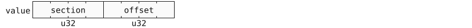

**align**: 4

`far` is encoded as a fat pointer of the `section` id and an `offset` from its beginning.

null `far` pointer has its `section` and `offset` set to `0`.

# items

items are schema constructs that defines composite data structures of concrete members.

they are product (structs) and sum (unions) types that has rich sematics: generics, tagging, trees, ananymous, fixed, rich notation...

each item gets its own `0` indexed id based on its order in file, with max of `65536 (2 ^ 16)` items inside a single file.

items with `_` name get skipped, with ids still counting them.

### inner definitions

```gramex
let inner_def = "struct" name:ident struct_body | "enum" name:ident enum_body;
```

items can be declerated inlined withen others fields, becoming their types.

they can be ananonymous (no name is given), and inherit the `fixed` modifiers and the generics of the parent item.

they gets the id directly after their parent id and in decleration order, and this carries to their nested ones.

inner definitions can also be used inside generic parameters.

#### example

```structom
// id = 0
struct Element {
	tag: str,
	attr: list</* id = 1 */ struct {
		// id = 2
		name: struct AttrName(str),
		value: any
	}>,
	children: list<Element>
}

struct _ {}

// id = 4
fixed union Union<T> {
	A, B, C,
	D(/* id = 5 */ enum { A, B, C(T) }),
	E { v?: list<T> },
}
```

## structs

structs are product data type that are composed of fixed set of well defined members called fields.

structs translate to structs, objects, maps, tables, records... in other languages.

structs has default value of null pointer, or the default value of all its field if it is fixed.

structs can be nested inside themself.

#### example

```structom
struct Struct {
	a: str,
	b: u16,
	c: list<u8>,
}

Struct {
	a: "abc",
	b: 123,
	c: 0x"01 02 03",
}
```

### definition

```gramex
let struct_def = "fixed"? "struct" name:ident generic_params? struct_body;
let struct_body = '(' inner:type_spec ')' | '{' list<field_def>? '}';

let field_def = name:ident '?'? ':' type:type_spec ('=' default:value);
```

structs are defined by a struct definition.

it is a decleration that consists of the struct `name` followed by optionally generic parameters then its fields inside the body.

generally the struct body is a list of fields definition inside a curly block.

each field definition is composed of a name and a type specifier, the field can be optional using `?`.

if an optional field is not specified, it take its type default value, unless a default value is provided using `= value`.

fields named `_` are skipped but their place in binary encoding is reserved.

struct can have zero fields, and can be defined inline within other items field.

#### example

```structom
struct Struct {
	a: str,
	b: u16,
	c?: list<Struct>,
	d?: struct { min: f64, max: f64 },
}
```

### object value

```gramex
let struct_value = fields_value | tree_value | tagged_inner:value;
let fields_value = '{' fields:list<field_value>? '}';
let field_value = name:ident ':' value;
```

structs are represented by a list of fields with thier values inside a curly block.

the type specifier can be omited if it can be infered.

#### example

```structom
Struct {
	a: "abc",
	b: 123,
	c: [
		{ a: "a2", b: 123 },
	],
	d: { min: 0.0, max: 1.0 },
}
```

### binary encoding

structs are encoded as a pointer to an object containing the struct fields.

the object starts a `u32` length field followed by the fields allocated according to the following:

- fields are allocated in definition order. each field takes the first padding, in ascending order, that can hold it at its natural alignment.
- if none fits, the field is allocated at the end aligned.

```
field_loop: for field in fields {
	for pad in padding {
		let offset = pad.start.align_to(field.align)
		if offset + field.size <= pad.end {
			padding.split(pad, at: offset, size: field.size)
			alocate(field, at: offset)
			continue field_loop
		}
	}
	let offset = end.align_to(field.align)
	if offset != end { padding.insert(start: end, end: offset) }
	alocate(field, at: offset)
}
```

bit fields (`bool`s) are alocated togather as `u8` fields during alocation, they fill bit `0` till `7`, then a new byte is allocated.

non pointer optional fields allocate aditional bit field after them, if it is `1` a value is given inside the field, else the defualt value is used.

non specified pointer optional fields are encoded as null pointer.

#### example

```structom
struct Struct {
	a: u32,
	b: u8,
	c: u64,
	d: u16,
	e?: u16,
	f: bool,
	g: u8
}
```

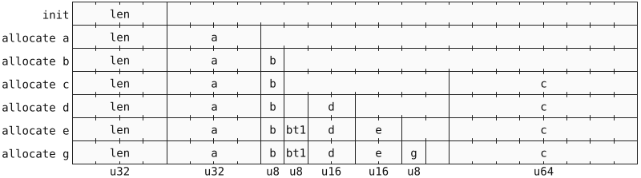

**bt1**: bit fields (bool and optional flags)

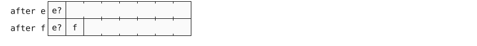

### fixed struct

a struct with the `fixed` modifier are encoded inlined in the parent struct directly.

fixed struct is encoded as one big field encoding all its fields using the regular struct encoding with no `len` field.

this big field has alignment of the maximum of the fields alignment, and a size fitting all the fields and aligned to the alignment.

fixed structs are frozen in time and can not evolve.

#### example

```
struct Parent {
	a: u16,
	b: Fixed,
	c: u16,
}
fixed struct Fixed {
	a: u32,
	b: u16
}
```


### tagged struct

tagged structs are structs wrapping a value.

tagged structs body in definition is the inner type wrapped inside a paranthesis.

tagged struct object notation value is thier type specifier followed by the value of their inner type.

the inner value is written without a type specifier, even nested tagged structs.

tagged structs are transparent in binary encoding, their encoding is their inner type encoding.

#### example

```structom
struct A(u32)
struct B<T>(T)

[A 123, B<A> 456]
```

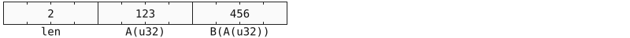

### tree struct

```gramex
let tree_value = fields_value? '[' children:list<value>? ']';
```

tree structs are object notation value sugar for structs of tree liked shapes.

a struct is tree like if it has a `children` field of type being `arr`, `list` or tagged struct of them.

a braket enclosed list of values being `children` field value can be provided after the fields block, which become also optional.

#### example

```gramex
struct Node {
	tag: str = "node",
	attrs?: list<str, any>,
	children?: list<Node>
}

Node {
	tag: "a",
	attrs: { id: "a1" },
} [
	Node { tag: 'b' },
	Node [ Node {}, Node { tag: 'c' } ]
]
```

## unions

### definition

### object value

### binary encoding

### fixed union

# collections

## str

## array

## list

## map

# rich types

## uuid

## inst

## duration

## url

## bigint

## decimal

## bytes

## color

## semver

# apendix

## standared metadata

## evolution guide

## typeid maps
